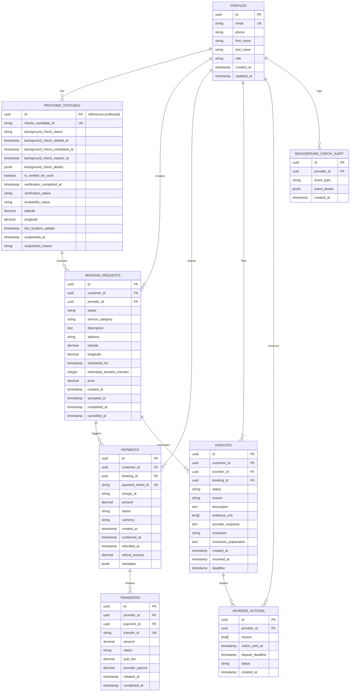

# Yuki Database Entity-Relationship Diagram

**Last Updated:** September 8, 2026

---

## Visual ERD



---

## Table Definitions

### 1. PROFILES (Core Users Table)

**Purpose:** Store all user accounts (customers and providers)

| Column | Type | Constraints | Notes |
|--------|------|-------------|-------|
| `id` | UUID | PK, NOT NULL | Matches `auth.users.id` from Supabase Auth |
| `email` | TEXT | UNIQUE, NOT NULL | User's email |
| `phone` | TEXT | NOT NULL | E.164 format |
| `first_name` | TEXT | NOT NULL | Legal first name |
| `last_name` | TEXT | NOT NULL | Legal last name |
| `role` | TEXT | CHECK IN ('customer', 'provider'), NOT NULL | User type |
| `created_at` | TIMESTAMP | NOT NULL, DEFAULT NOW() | Account creation |
| `updated_at` | TIMESTAMP | NOT NULL, DEFAULT NOW() | Last profile update |

**Row-Level Security:**
- Users can see only their own row
- Providers/customers cannot access each other's full details

**Indexes:**
- Primary key on `id`
- Unique index on `email`

---

### 2. PROVIDER_STATUSES (Provider-Specific Data)

**Purpose:** Track provider verification, availability, and location

| Column | Type | Constraints | Notes |
|--------|------|-------------|-------|
| `id` | UUID | PK, FK → profiles(id), NOT NULL | Same as provider's profile ID |
| `checkr_candidate_id` | TEXT | UNIQUE | Checkr's candidate ID for background checks |
| `background_check_status` | TEXT | CHECK IN ('not_started', 'pending', 'clear', 'failed', 'under_review', 'disputed') | Verification status |
| `background_check_started_at` | TIMESTAMP | | When check initiated |
| `background_check_completed_at` | TIMESTAMP | | When results received |
| `background_check_expires_at` | TIMESTAMP | | When re-check needed (1 year) |
| `background_check_details` | JSONB | | {report_id, result, consider_reasons, ...} |
| `is_verified_for_work` | BOOLEAN | DEFAULT FALSE | Can accept bookings? |
| `verification_completed_at` | TIMESTAMP | | Final verification timestamp |
| `verification_status` | TEXT | CHECK IN ('approved', 'rejected', 'pending') | Approval outcome |
| `availability_status` | TEXT | CHECK IN ('offline', 'online', 'on_a_job') | Current availability |
| `latitude` | DECIMAL(9,6) | | Real-time location (only when online) |
| `longitude` | DECIMAL(9,6) | | Real-time location |
| `last_location_update` | TIMESTAMP | | When location was last updated |
| `suspended_at` | TIMESTAMP | | If account temporarily suspended |
| `suspended_reason` | TEXT | | Reason for suspension |

**Row-Level Security:**
- Providers see only their own row
- Customers see only verified/online providers' public data
- Locations visible only when provider is "Available Now"

**Indexes:**
- Primary key on `id`
- Unique index on `checkr_candidate_id`
- Index on `background_check_status` (fast filtering)
- Index on `is_verified_for_work` (find approved providers)
- PostGIS spatial index on (latitude, longitude)

**PostGIS Function:**
```sql
CREATE OR REPLACE FUNCTION get_nearby_providers(
  longitude DECIMAL,
  latitude DECIMAL,
  radius_miles INT DEFAULT 5
)
RETURNS TABLE (...) AS $$
  SELECT ...
  WHERE ST_DWithin(
    ST_SetSRID(ST_Point(p.longitude, p.latitude), 4326),
    ST_SetSRID(ST_Point($1, $2), 4326),
    radius_miles * 1609.34  -- Convert miles to meters
  )
  AND p.is_verified_for_work = TRUE
  AND p.availability_status = 'online'
$$ LANGUAGE SQL;
```

---

### 3. BOOKING_REQUESTS (Service Requests)

**Purpose:** Store service booking requests and their status

| Column | Type | Constraints | Notes |
|--------|------|-------------|-------|
| `id` | UUID | PK, NOT NULL | Unique booking ID |
| `customer_id` | UUID | FK → profiles(id), NOT NULL | Who requested |
| `provider_id` | UUID | FK → provider_statuses(id), NOT NULL | Who provides |
| `status` | TEXT | CHECK IN ('pending_acceptance', 'accepted', 'in_progress', 'completed', 'cancelled') | Current state |
| `service_category` | TEXT | NOT NULL | cleaning, repairs, tutoring, etc. |
| `description` | TEXT | NOT NULL | What customer needs |
| `address` | TEXT | NOT NULL | Service location |
| `latitude` | DECIMAL(9,6) | NOT NULL | Service location coordinates |
| `longitude` | DECIMAL(9,6) | NOT NULL | Service location coordinates |
| `scheduled_for` | TIMESTAMP | NOT NULL | When service should happen |
| `estimated_duration_minutes` | INTEGER | NOT NULL | How long it should take |
| `price` | DECIMAL(10,2) | NOT NULL | Service cost |
| `created_at` | TIMESTAMP | NOT NULL, DEFAULT NOW() | When booking was created |
| `accepted_at` | TIMESTAMP | | When provider accepted |
| `completed_at` | TIMESTAMP | | When service finished |
| `cancelled_at` | TIMESTAMP | | When booking was cancelled |

**Row-Level Security:**
- Customers see only their own bookings
- Providers see only their accepted/ongoing bookings
- Messages and location only visible to both parties

**Indexes:**
- Primary key on `id`
- Foreign keys on `customer_id` and `provider_id`
- Index on `status` (find active/completed bookings)
- Index on `created_at` (recent bookings)
- Composite index on (`provider_id`, `status`)

**Real-Time Broadcast:** Enabled for:
- Customers to see acceptance status updates
- Providers to get new booking notifications

---

### 4. PAYMENTS (Payment Records)

**Purpose:** Track all transactions (Stripe integration)

| Column | Type | Constraints | Notes |
|--------|------|-------------|-------|
| `id` | UUID | PK, NOT NULL | Yuki's payment reference |
| `customer_id` | UUID | FK → profiles(id), NOT NULL | Who paid |
| `booking_id` | UUID | FK → booking_requests(id), NOT NULL | For what service |
| `payment_intent_id` | TEXT | UNIQUE, NOT NULL | Stripe Payment Intent ID |
| `charge_id` | TEXT | | Stripe Charge ID (after confirmation) |
| `amount` | DECIMAL(10,2) | NOT NULL | Amount charged in USD |
| `status` | TEXT | CHECK IN ('requires_payment_method', 'processing', 'succeeded', 'failed', 'refunded') | Payment state |
| `currency` | TEXT | DEFAULT 'usd' | Currency code |
| `created_at` | TIMESTAMP | NOT NULL, DEFAULT NOW() | When payment created |
| `confirmed_at` | TIMESTAMP | | When payment confirmed |
| `refunded_at` | TIMESTAMP | | When refund issued |
| `refund_amount` | DECIMAL(10,2) | | Partial refund amount |
| `metadata` | JSONB | | {idempotency_key, dispute_id, ...} |

**Row-Level Security:**
- Customers see only their own payments
- Providers see only their received payments (via transfers)

**Indexes:**
- Primary key on `id`
- Unique index on `payment_intent_id` (Stripe lookups)
- Foreign key on `booking_id` (find payment for booking)
- Index on `status` (find succeeded/failed payments)
- Index on `created_at` (recent payments)

**Security:** 
- **NEVER store full card numbers** (handled by Stripe)
- Store only PaymentMethod IDs as tokens
- No PII beyond what's needed

---

### 5. TRANSFERS (Provider Payouts)

**Purpose:** Track money transferred to provider accounts (Stripe Connect)

| Column | Type | Constraints | Notes |
|--------|------|-------------|-------|
| `id` | UUID | PK, NOT NULL | Yuki's transfer reference |
| `provider_id` | UUID | FK → profiles(id), NOT NULL | Who receives payment |
| `payment_id` | UUID | FK → payments(id), NOT NULL | From what payment |
| `transfer_id` | TEXT | UNIQUE | Stripe Transfer ID |
| `amount` | DECIMAL(10,2) | NOT NULL | Amount transferred |
| `status` | TEXT | CHECK IN ('pending', 'processing', 'succeeded', 'failed', 'cancelled') | Transfer state |
| `yuki_fee` | DECIMAL(10,2) | NOT NULL | Yuki's commission (10% of price) |
| `provider_payout` | DECIMAL(10,2) | NOT NULL | amount - yuki_fee - stripe_fee |
| `initiated_at` | TIMESTAMP | NOT NULL | When transfer created |
| `completed_at` | TIMESTAMP | | When funds arrived |

**Timeline:**
1. Payment confirmed → Transfer `pending` (held for dispute window)
2. After 48-hour dispute window → Transfer `processing`
3. Stripe processes → Transfer `succeeded`
4. Provider can withdraw

**Indexes:**
- Primary key on `id`
- Unique index on `transfer_id` (Stripe lookups)
- Foreign key on `provider_id` (provider earnings)
- Index on `status` (find pending/completed transfers)

---

### 6. DISPUTES (Payment Disputes)

**Purpose:** Track customer complaints and resolution process

| Column | Type | Constraints | Notes |
|--------|------|-------------|-------|
| `id` | UUID | PK, NOT NULL | Dispute ID |
| `customer_id` | UUID | FK → profiles(id), NOT NULL | Who filed |
| `provider_id` | UUID | FK → profiles(id), NOT NULL | Against whom |
| `booking_id` | UUID | FK → booking_requests(id), NOT NULL | For what booking |
| `status` | TEXT | CHECK IN ('open', 'investigating', 'resolved', 'appealed') | Dispute state |
| `reason` | TEXT | CHECK IN ('service_not_provided', 'provider_no_show', 'quality_issue', 'safety_concern', 'other') | Type of complaint |
| `description` | TEXT | NOT NULL | Customer's explanation |
| `evidence_urls` | TEXT[] | | URLs to photos/documents |
| `provider_response` | TEXT | | Provider's side of story |
| `resolution` | TEXT | CHECK IN ('full_refund', 'partial_refund', 'deny', 'no_fault') | Decision |
| `resolution_explanation` | TEXT | | Why decision was made |
| `created_at` | TIMESTAMP | NOT NULL, DEFAULT NOW() | When dispute filed |
| `resolved_at` | TIMESTAMP | | When resolved |
| `deadline` | TIMESTAMP | NOT NULL | 48 hours after booking completion |

**Dispute Window:** 48 hours after booking completion (enforced by `deadline`)

**Resolution Process:**
1. Customer files within 48 hours → `open`
2. Yuki reviews evidence → `investigating`
3. Yuki makes decision → `resolved`
4. If provider appeals → `appealed` (rare)

**Indexes:**
- Primary key on `id`
- Foreign keys on `customer_id`, `provider_id`, `booking_id`
- Index on `status` (find open disputes)
- Index on `deadline` (find expired disputes)

---

### 7. ADVERSE_ACTIONS (FCRA Compliance)

**Purpose:** Track background check rejection notices (FCRA requirement)

| Column | Type | Constraints | Notes |
|--------|------|-------------|-------|
| `id` | UUID | PK, NOT NULL | Notice ID |
| `provider_id` | UUID | FK → profiles(id), NOT NULL | Who was notified |
| `reason` | TEXT[] | NOT NULL | Array of reasons (e.g., ["Misdemeanor conviction"]) |
| `notice_sent_at` | TIMESTAMP | NOT NULL | When FCRA notice was sent |
| `dispute_deadline` | TIMESTAMP | NOT NULL | 30 days after notice (FCRA requirement) |
| `status` | TEXT | CHECK IN ('pending_response', 'disputed', 'resolved', 'expired') | Dispute status |
| `created_at` | TIMESTAMP | NOT NULL, DEFAULT NOW() | When notice record created |

**FCRA Requirement:** Provider has 30 days from `notice_sent_at` to dispute

**Indexes:**
- Primary key on `id`
- Foreign key on `provider_id`
- Index on `dispute_deadline` (find expiring deadlines)
- Index on `status` (find open disputes)

---

### 8. BACKGROUND_CHECK_AUDIT_LOG (Compliance Logging)

**Purpose:** Complete audit trail of all background check events (for regulatory review)

| Column | Type | Constraints | Notes |
|--------|------|-------------|-------|
| `id` | UUID | PK, NOT NULL | Log entry ID |
| `provider_id` | UUID | FK → profiles(id), NOT NULL | Who this is about |
| `event_type` | TEXT | NOT NULL | consent_given, check_started, report_received, adverse_notice_sent, dispute_filed, dispute_resolved, provider_activated |
| `event_details` | JSONB | | {timestamp, action, details, ...} |
| `created_at` | TIMESTAMP | NOT NULL, DEFAULT NOW() | When logged |

**Example Events:**
```json
{event_type: "consent_given", timestamp: "2026-09-08T10:00:00Z"}
{event_type: "check_started", checkr_candidate_id: "cand_xxx"}
{event_type: "report_received", result: "clear", checkr_report_id: "rpt_xxx"}
{event_type: "adverse_notice_sent", reason: ["Misdemeanor"], deadline: "2026-10-08"}
{event_type: "dispute_filed", dispute_id: "disp_xxx"}
{event_type: "provider_activated", verification_completed_at: "2026-09-10T14:30:00Z"}
```

**Retention:** 2 years (for regulatory compliance)

**Indexes:**
- Primary key on `id`
- Foreign key on `provider_id`
- Index on `created_at` (find recent events)

---

## Data Relationships

### Primary Flows

**1. Customer Booking Flow:**
```
PROFILES (customer)
  ↓ creates
BOOKING_REQUESTS (pending_acceptance)
  ↓ (provider accepts)
BOOKING_REQUESTS (accepted)
  ↓ (payment triggered)
PAYMENTS (succeeded)
  ↓ (after 48-hour dispute window)
TRANSFERS (succeeded)
  ↓ (provider withdraws)
TRANSFERS (completed)
```

**2. Provider Verification Flow:**
```
PROFILES (new provider)
  ↓
PROVIDER_STATUSES (background_check_status: pending)
  ↓ (Checkr initiates)
BACKGROUND_CHECK_AUDIT_LOG (check_started)
  ↓ (Checkr reports results)
PROVIDER_STATUSES (background_check_status: clear/failed)
BACKGROUND_CHECK_AUDIT_LOG (report_received)
  ↓ (If clear)
PROVIDER_STATUSES (is_verified_for_work: true)
BACKGROUND_CHECK_AUDIT_LOG (provider_activated)
  ↓ (If adverse)
ADVERSE_ACTIONS (notice_sent)
BACKGROUND_CHECK_AUDIT_LOG (adverse_notice_sent)
  ↓ (If disputed)
BACKGROUND_CHECK_AUDIT_LOG (dispute_filed)
BACKGROUND_CHECK_AUDIT_LOG (dispute_resolved)
```

**3. Dispute Flow:**
```
BOOKING_REQUESTS (completed)
  ↓ (within 48 hours)
DISPUTES (open)
  ↓
AUDIT_LOGS (dispute_filed)
  ↓ (Yuki investigates)
DISPUTES (investigating)
  ↓ (Admin resolves)
DISPUTES (resolved)
  ↓ (If refund)
PAYMENTS (refunded)
  ↓
TRANSFERS (cancelled/reversed)
```

---

## Key Indexes for Performance

| Table | Index | Reason |
|-------|-------|--------|
| PROVIDER_STATUSES | PostGIS on (lat, lon) | Geospatial queries (5-mile radius) |
| PROVIDER_STATUSES | on (is_verified_for_work) | Filter available providers |
| BOOKING_REQUESTS | on (provider_id, status) | Find active jobs per provider |
| BOOKING_REQUESTS | on (customer_id, created_at) | Recent bookings per customer |
| PAYMENTS | on (status) | Find succeeded/failed payments |
| PAYMENTS | on (booking_id) | Find payment for booking |
| DISPUTES | on (status, deadline) | Find open/expiring disputes |
| TRANSFERS | on (provider_id, status) | Provider earnings summary |

---

## Database Constraints

### Logical Constraints

1. **Provider Availability Expiration**
   - Availability expires 30 min after activation
   - Trigger: Auto-expire if not refreshed

2. **Dispute Deadline Enforcement**
   - Disputes must be filed within 48 hours of booking completion
   - Query: `booking.completed_at + 48 hours > NOW()`

3. **FCRA Dispute Deadline**
   - Provider has 30 days to dispute adverse background check
   - Query: `adverse_action.notice_sent_at + 30 days > NOW()`

4. **Payment Hold Period**
   - Transfers stay `pending` for 48-hour dispute window
   - Query: `payment.confirmed_at + 48 hours <= NOW()` to release

5. **Background Check Expiry**
   - Re-checks required annually
   - Query: `provider_status.background_check_expires_at < NOW()` → notify provider

---

## Database Size Estimates

| Table | Rows (1 Year) | Storage |
|-------|---------------|---------|
| PROFILES | 1,000 | 150 KB |
| PROVIDER_STATUSES | 500 | 50 KB |
| BOOKING_REQUESTS | 10,000 | 2 MB |
| PAYMENTS | 10,000 | 2 MB |
| TRANSFERS | 10,000 | 1 MB |
| DISPUTES | 50 | 10 KB |
| ADVERSE_ACTIONS | 50 | 10 KB |
| BACKGROUND_CHECK_AUDIT | 1,000 | 200 KB |
| **TOTAL** | **32,600** | **~5.5 MB** |

*(Scales linearly with user growth)*

---

## Security Summary

✅ Row-Level Security (RLS) on all tables  
✅ No plaintext passwords (hashed by Supabase Auth)  
✅ No full credit card numbers (Stripe handles that)  
✅ Audit logs for all sensitive events  
✅ Encrypted connections (TLS in transit)  
✅ Timestamps on all records (data lineage)  
✅ Foreign key constraints (referential integrity)  

---

## Next Steps

1. **Execute migration** in Supabase SQL Editor (copy from `20260908000001_initial_schema.sql`)
2. **Verify RLS policies** are enforced
3. **Test PostGIS queries** with sample locations
4. **Create indexes** as listed above
5. **Set up monitoring** for query performance

